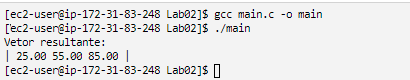

## Documentação do trabalho

- **O editor de texto utilizado foi o `nano`.**

- **Foi colocado o código proposto em um arquivo chamado `main.c`.**

- **O arquivo 'main.c' pode ser executados da seguinta forma:** 
	- `gcc main.c - o <nome_desejado>`
	- `./<nome_desejado>`

- **Foram colocadas screenshots da execução no ambiente aws dos códigos nos seguintes arquivos:**
	- `console.png`

## Imagens da AWS 

## Integrantes do grupo:
- **Nome: Gabriel Gonzaga Chung TIA: 32263651**
