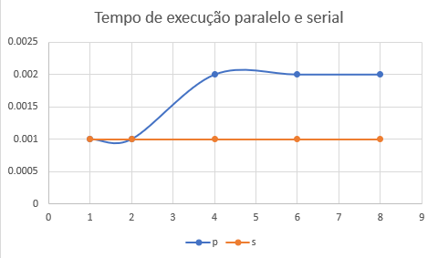
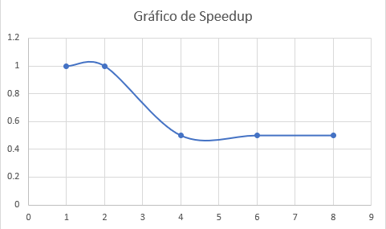
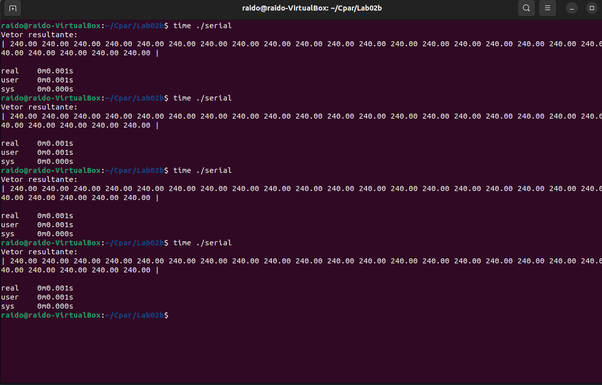
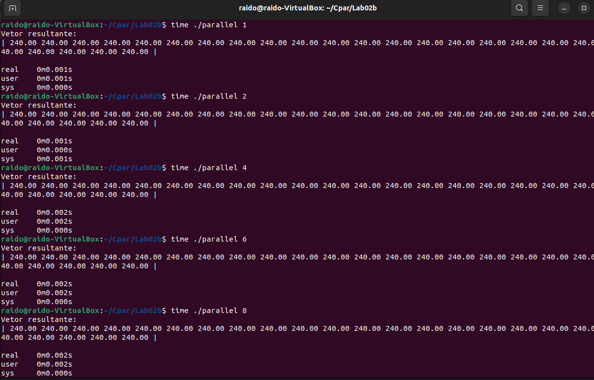
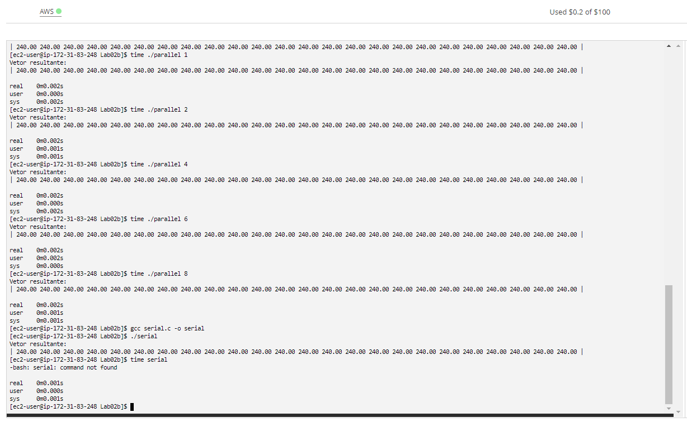

## Documentação do trabalho

- **O editor de texto utilizado foi o `nano`.**

- **Foi colocado a versão serial em um arquivo `serial.c`.**

- **Foi colocado a versão paralela em um arquivo `parallel.c`.**

- **Foi colocado as informações do processador no arquivo `Data/processor.txt`.**

- **Foi colocado as informações do tempo obtido utilizando o comando `time` nos seguintes arquivos:**

  - `Data/serial_time.txt`
  - `Data/parallel_time.txt` 
 
- **O arquivo 'serial.c' pode ser executados da seguinta forma:** 
	- `gcc serial.c - o <nome_desejado>`
	- `./<nome_desejado>`

- **O arquivo 'parallel.c' pode ser executados da seguinta forma:** 
	- `gcc parallel.c - o <nome_desejado>`
	- `./<nome_desejado> <número de threads>`

- **Foram colocadas screenshots da execução no ambiente aws dos códigos nos seguintes arquivos:**
	- `Assets/console.png`

## Gráfico dos tempos de execução paralelo e serial em relação ao número de processadores
- **Eixo horizontal número de processadores**
- **Eixo vertical tempo em segundos**
- **Linha laranja se trata da execução serial**
- **LInha azul se trata da execução paralela**     

## Gráfico de Speedup em relação ao número de processadores
- **Eixo horizontal número de processadores**
- **Eixo vertical speedup**  

## Imagens do tempo de execução na VM

-----------------------

## Imagens da AWS 

## Integrantes do grupo:
- **Nome: Gabriel Gonzaga Chung TIA: 32263651**