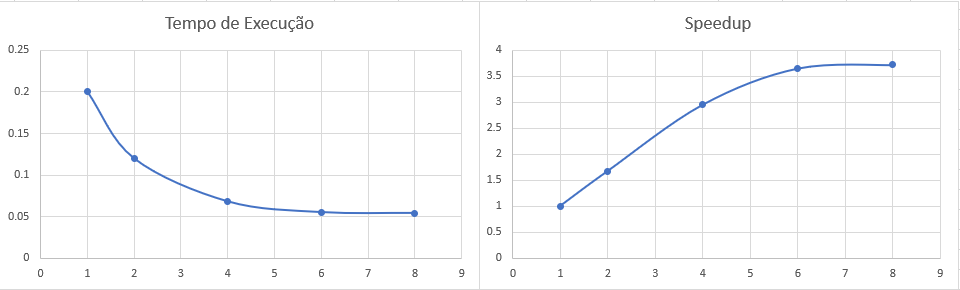

## Documentação do laboratório  
- **Foi montado uma solução paralela para calcular uma integral com método dos trapézios.**

- **O algorítmo divide, entre os threads, os trapézios a serem calculados.**

- **A solução com diretiva critical resolve o problema de condição de corrida, garantindo que somente um processo tem acesso a determinada variável compartilhada em cada momento quando isso for necessário à correção do programa.**

- **O algorítmo utiliza diretrizes da `openMP`.**

- **O editor de texto utilizado foi o `nano`.**

- **Foi colocado a solução do código sem diretiva critical em `trap.c`.**

- **Foi colocado a solução do código com diretiva critical em `trap2.c`.**

- **Foi colocado as informações do processador no arquivo**	
  - `data/processor.txt`
  -	`data/processor_aws.txt`

- **Foi colocado as informações do tempo obtido utilizando o comando `time` nos seguintes arquivos:**

  - `data/trap_time.txt`
  - `data/trap2_time.txt` 

- **O arquivo 'trap.c' pode ser executados da seguinta forma:** 
	- `gcc -g -Wall -fopenmp -o trap trap.c -lm`
	- `./trap <número de threads>`

- **O arquivo 'trap2.c' pode ser executados da seguinta forma:** 
	- `gcc parallel.c -o trap2 trap2.c -lm`
	- `./trap2 <número de threads>`

- **Foram colocadas screenshots da execução no ambiente aws dos códigos nos seguintes arquivos:**
	- `assets/console.png`

## Gráficos de Tempo de Execução e Speedup
- **Eixo horizontal número de processadores**
- **Eixo vertical tempo de execução ou speedup**  
### Sem diretiva critical

-----------------------
### Com diretiva critical  

## Imagens do tempo de execução num Linux (Ubuntu)
**Tempo de Execução do algorítmo sem diretiva critical**  
  
  
-----------------------
**Tempo de Execução do algorítmo com diretiva critical**  
  
  
-----------------------
## Imagens da AWS 

## Integrantes do grupo:
- **Nome: Gabriel Gonzaga Chung RA: 10403025**