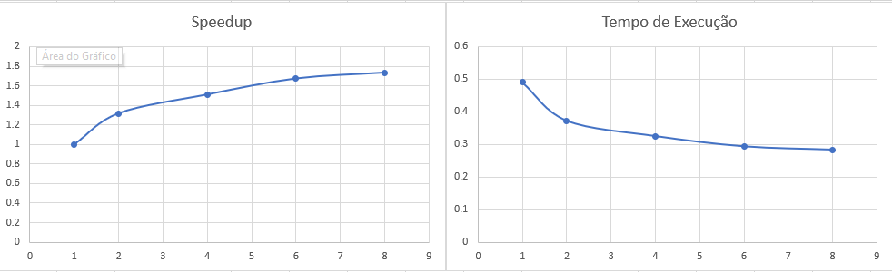
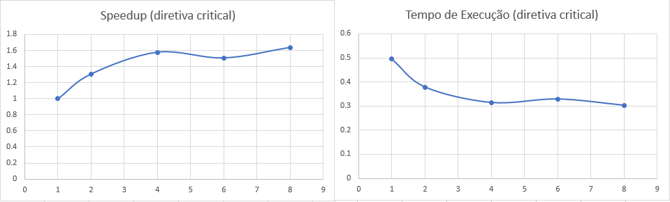
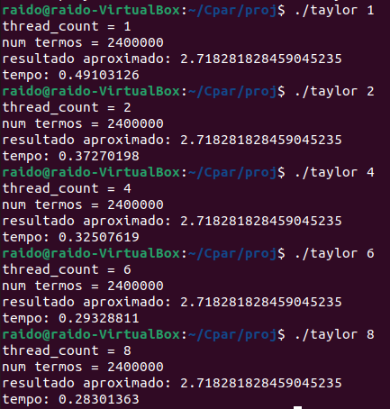
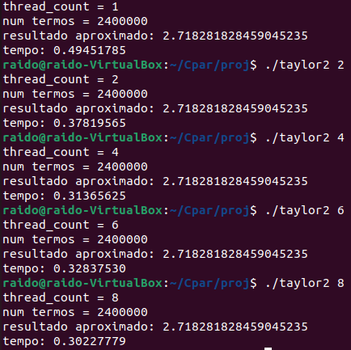

## Documentação do projeto 
- **Foi montado uma solução paralela para calcular o valor de `e` utilizando a `Série de Taylor` .**

- **A parte sequencial principal do algorítmo, para cada fatorial, calcula e armazena o valor obtido em um espaço de um vetor que se trata de uma "tabela" para os valores de fatoriais.**

- **A parte paralela, calcula em cada thread, um pedaço da soma da `Série de Taylor` e armazena o resultado em uma variável compartilhada.**

- **A solução com diretiva critical resolve o problema de condição de corrida, garantindo que somente um processo tem acesso a variável compartilhada em cada momento quando isso for necessário à correção do programa.**

- **O algorítmo utiliza diretrizes da `openMP`.**

- **O editor de texto utilizado foi o `nano`.**

- **Foi colocado a solução do código sem diretiva critical em `taylor.c`.**

- **Foi colocado a solução do código com diretiva critical em `taylor2.c`.**

- **Foi colocado as informações do processador no arquivo**	
  - `data/processor.txt`

- **Foi colocado as informações do tempo obtido utilizando a função `omp_get_wtime()` nos seguintes arquivos:**

  - `data/taylor_time.txt`
  - `data/taylor2_time.txt` 

- **O arquivo `taylor.c` pode ser executados da seguinta forma:** 
	- `gcc -g -Wall -fopenmp -o taylor taylor.c -lm`
	- `./taylor <número de threads>`

- **O arquivo `taylor2.c` pode ser executados da seguinta forma:** 
	- `gcc parallel.c -o taylor2 taylor2.c -lm`
	- `./taylor2 <número de threads>`

## Gráficos de Tempo de Execução e Speedup
- **Eixo horizontal número de processadores**
- **Eixo vertical tempo de execução ou speedup**  
### Sem diretiva critical

-----------------------
### Com diretiva critical  

## Imagens do tempo de execução num Linux (Ubuntu)
**Tempo de Execução do algorítmo sem diretiva critical**  
  
-----------------------
**Tempo de Execução do algorítmo com diretiva critical**  
  
-----------------------

## Integrantes do grupo:
- **Nome: Gabriel Gonzaga Chung RA: 10403025**